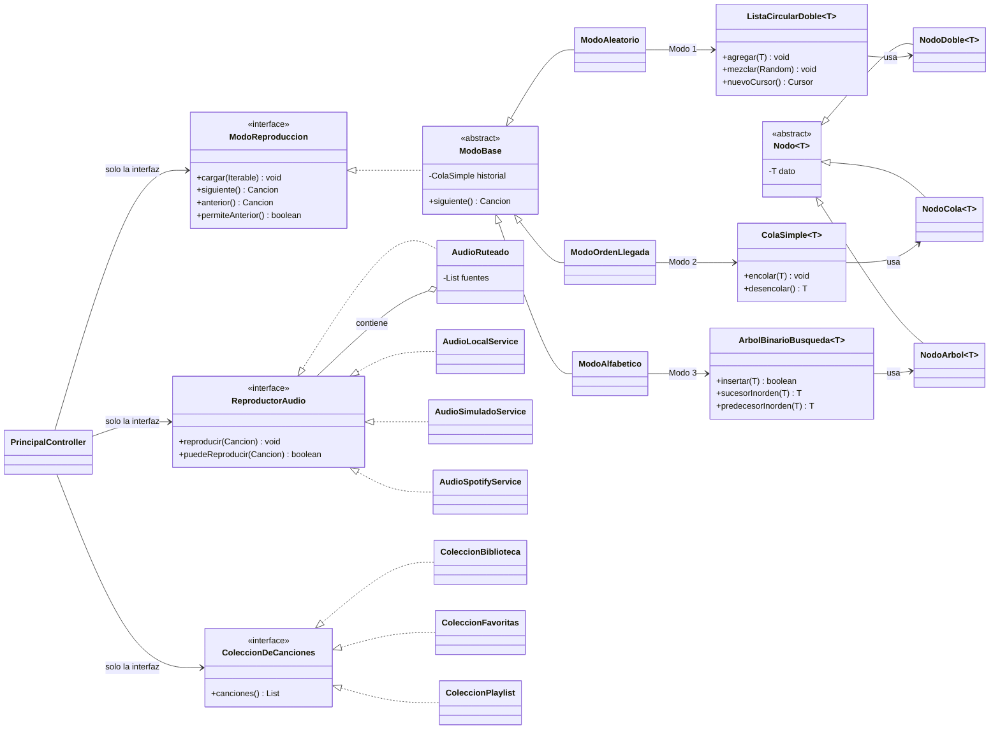

# Reproductor Camellos vs Enanos

Reproductor de música de escritorio en Java 21 + JavaFX 21.
Trabajo 1 de *Lenguajes y Compiladores* — Universidad EIA.

Cada modo de reproducción usa una **estructura de datos distinta, implementada desde cero**:

| Modo | Estructura | Archivo |
|---|---|---|
| Aleatorio | Lista circular doblemente enlazada | `estructuras/ListaCircularDoble.java` |
| Orden de llegada | Cola FIFO | `estructuras/ColaSimple.java` |
| Alfabético | Árbol binario de búsqueda con punteros al padre | `estructuras/ArbolBinarioBusqueda.java` |

Para la sustentación: [Arquitectura](#arquitectura) ·
[Complejidades temporales](#complejidades-temporales) ·
[Guion de sustentación](#guion-de-sustentación)

---

## Cómo ejecutarlo

**Requisitos mínimos: solo JDK 21.** No hace falta instalar Maven: se usa el que trae IntelliJ.

1. Abrir `pom.xml` en IntelliJ (*File → Open*).
2. Fijar el SDK del proyecto a **JDK 21** en *File → Project Structure*.
   Con JDK 23 también compila, pero 21 es la versión con la que está probado.
3. Panel de Maven → `Plugins` → `javafx` → `javafx:run`.

La aplicación arranca **sin internet y sin configuración**. Las carátulas y la búsqueda de
metadatos son opcionales.

```
mvn test     # 454 pruebas
```

---

## Atajos de teclado

Funcionan en cualquier punto de la ventana, salvo mientras se escribe en un campo o está abierto
un desplegable.

| Tecla | Acción |
|---|---|
| `Espacio` | Reproducir / pausar |
| `←` `→` | Retroceder / adelantar 5 segundos |
| `Ctrl` + `←` `→` | Canción anterior / siguiente |
| `Ctrl` + `N` | Agregar canción |
| `Ctrl` + `F` | Ir al buscador |
| `Ctrl` + `D` | Cambiar entre modo claro y oscuro |

---

## Buscar y filtrar

La fila de búsqueda tiene dos controles:

- **El selector de campo** (`TODO`, `TÍTULO`, `ARTISTA`, `ÁLBUM`, `GÉNERO`) decide dónde se busca.
  Con `TODO` se mira título, artista y álbum a la vez, como siempre.
- **El buscador** es un desplegable editable: se puede escribir, o abrirlo y elegir uno de los
  valores que **de verdad hay** en la biblioteca. Al agregar una canción de un género nuevo, ese
  género aparece solo en la lista — no hay ninguna lista fija de géneros en el código.

Las tildes y las mayúsculas dan igual: `clasica` encuentra `Música Clásica`. La lógica está en
`servicios/FiltroDeCampo.java`, fuera de la interfaz, para poder probarla sin abrir una ventana.

---

## Estadísticas

El botón **ESTADÍSTICAS**, en la cabecera de la biblioteca, abre el resumen de lo más escuchado:
total de reproducciones, minutos acumulados, canciones distintas, artista y género más escuchados,
y el podio de las cinco más repetidas. La columna **REPR.** de la tabla muestra lo mismo canción
por canción.

El contador sube al empezar cada reproducción y se guarda en `data/biblioteca.json`, así que
sobrevive al cerrar la aplicación. Las cuentas viven en `servicios/EstadisticasBiblioteca.java`; la
ventana solo las coloca en pantalla.

---

## Ver la estructura por dentro

El botón **VER ESTRUCTURA** abre una ventana que dibuja la estructura de datos que el modo activo
tiene cargada **en ese momento**: no es una ilustración fija.

- En **Aleatorio**, el anillo con el cursor: se ve que el último enlaza con el primero.
- En **Orden de llegada**, la cola vaciándose de verdad, con la cuenta de las que ya salieron.
- En **Alfabético**, la forma real del árbol. Si las canciones entraron ya ordenadas, se ve
  degenerar en una sola rama.

Se puede dejar abierta al lado mientras suena la música. Por dentro, cada modo describe su
estructura con `estructuraVisual()` y el dibujante hace un `switch` sobre una interfaz `sealed`
(`modelo/EstructuraVisual.java`): si algún día se agrega un cuarto modo, el proyecto no compila
hasta decidir cómo se dibuja.

---

## Listas de reproducción

El selector **LISTA**, encima de la tabla, elige qué se ve y qué suena:

| Entrada | Qué contiene |
|---|---|
| `TODA LA BIBLIOTECA` | Todas las canciones |
| `★ FAVORITAS` | Las que tienen la estrella; se actualiza sola |
| `↺ HISTORIAL` | Lo último reproducido, de lo más reciente a lo más antiguo |
| Las tuyas | Las que crees con **NUEVA** |

> El historial no es una lista aparte: **es la `ColaSimple` que cada modo lleva dentro**, sacada a
> la interfaz. Encolar y descartar la más antigua cuesta O(1).

**Cualquier lista suena con cualquiera de los tres modos.** Es el mismo botón de siempre: elegís la
lista y después el modo, y la estructura de datos correspondiente se llena con esas canciones.

- **Agregar o quitar**: clic derecho sobre una canción de la tabla.
- **Estando en una lista**, el botón AGREGAR mete la canción nueva también en ella.
- **Borrar una lista** no borra sus canciones: siguen en la biblioteca.

Se guardan en `data/playlists.json`. Las listas apuntan a las canciones por identificador, así que
editar un título se refleja en todas y borrar una canción la saca de todas.

---

## Audio

Hay varias fuentes de audio y el reproductor elige sola la que corresponde a cada canción.
El rótulo `AUDIO:` bajo el título de la canción dice cuál está sonando.

| Fuente | Cuándo se usa | Requiere |
|---|---|---|
| **Archivo local** | La canción tiene un `.mp3` o `.wav` que existe | Nada |
| **Simulado** | La canción solo tiene metadatos | Nada |
| **Spotify** | La canción tiene URI de Spotify | Rust + cuenta Premium |

Para oír música: **AGREGAR CANCIÓN → Archivo local**.

---

## Fase 7b — Spotify con librespot

> [!IMPORTANT]
> **Esta parte es opcional.** Sin ella la aplicación funciona completa con audio local.
> Si no querés instalar nada, saltate esta sección entera.

`librespot` es una implementación libre del cliente de Spotify. No publica binarios para
Windows, así que hay que compilarlo, y para compilarlo hace falta Rust.

### 1. Instalar Rust

Descargar y ejecutar **[rustup](https://rustup.rs)** (`rustup-init.exe`).
Elegir la opción `1) Proceed with standard installation`.

Comprobar en una terminal **nueva** (el instalador cambia el `PATH`, hay que reabrirla):

```powershell
cargo --version
```

### 2. Instalar las Build Tools de MSVC

Rust en Windows compila con el enlazador de Microsoft, que no viene con rustup.
Sin esto, `cargo install` falla con `error: linker 'link.exe' not found`.

**Si ya tenés Visual Studio o Build Tools instalado** (muy probable), no bajes nada nuevo: abrí el
**Visual Studio Installer**, botón **Modificar** sobre la instalación que ya tenés, y marcá la carga
de trabajo **"Desarrollo de escritorio con C++"**.

Para saber si te falta, esto lista las instalaciones que **sí** tienen las herramientas de C++:

```powershell
& "C:\Program Files (x86)\Microsoft Visual Studio\Installer\vswhere.exe" `
    -all -products * -requires Microsoft.VisualStudio.Component.VC.Tools.x86.x64 -property displayName
```

Si no imprime nada, ninguna las tiene.

**Si no tenés nada instalado**, descargá
**[Build Tools para Visual Studio](https://visualstudio.microsoft.com/visual-cpp-build-tools/)** y
marcá la misma carga de trabajo.

> En cualquiera de los dos casos son varios GB y unos 15 minutos. Es la parte lenta.
> Al terminar hay que **abrir una terminal nueva** para que tome el `PATH`.

### 3. Compilar librespot

```powershell
cargo install librespot --locked
```

**Sin flags de features.** Los valores por defecto del crate ya son los correctos para Windows:
`native-tls` + `rodio-backend` + `with-libmdns`. Si le pasás `--no-default-features` para "aligerar",
la compilación falla con
`Either feature "native-tls" ... must be enabled`, porque `librespot-oauth` necesita TLS.

Tarda entre 5 y 15 minutos: compila todas las dependencias desde el código fuente.
Queda en `%USERPROFILE%\.cargo\bin\librespot.exe`, que rustup ya agregó al `PATH`.

```powershell
librespot --version
```

### 4. Configurar las credenciales

```powershell
copy config\spotify.properties.example config\spotify.properties
```

Un solo archivo. librespot (el de Rust) **no tiene archivo de configuración**: se configura por
argumentos de línea de comandos, que arma la aplicación. Los ajustes que te tocan a vos
(`device.name`, `librespot.bitrate`, `librespot.oauth.port`) están en ese mismo `.properties`.

Crear una aplicación en el **[dashboard de Spotify](https://developer.spotify.com/dashboard)**:

- **Redirect URI**: `http://127.0.0.1:8888/callback` — tiene que coincidir carácter por carácter.
- **APIs**: marcar *Web API*.

Copiar el **Client ID** al campo `client.id` de `config/spotify.properties`.

> [!WARNING]
> **Hace falta cuenta Premium.** librespot no puede reproducir con cuenta gratuita, y los
> endpoints de reproducción de la Web API devuelven `403` sin Premium.

> [!CAUTION]
> Nunca subas `config/spotify.properties`, `config/token-spotify.json` ni
> `data/librespot-cache/` — ahí librespot guarda **sus propias credenciales**, tan sensibles como
> el token. Los tres están en `.gitignore`; comprobalo con
> `git check-ignore -v config/token-spotify.json`.
> El único archivo de `config/` que se versiona es el `.example`, y va vacío.
> En OAuth con PKCE no hay client secret: el flujo existe justamente para no tener que guardar
> un secreto en una aplicación de escritorio.

### 5. Autorizar tu cuenta

```powershell
mvn exec:java "-Dexec.mainClass=com.eia.reproductor.servicios.spotify.DiagnosticoSpotify"
```

Se abre el navegador **una sola vez**. Autorizás, volvés a la terminal y deberías ver `HTTP : 200`
con tu nombre de usuario. El token queda en `config/token-spotify.json` y a partir de ahí el
navegador no vuelve a abrirse: se renueva solo.

Ese mismo comando sirve después como diagnóstico: si responde 200, la autenticación está bien y
cualquier problema de reproducción está en librespot, no en OAuth.

### 6. Comprobar que suena

```powershell
mvn exec:java "-Dexec.mainClass=com.eia.reproductor.servicios.spotify.DiagnosticoSpotify" "-Dexec.args=--librespot"
```

Lanza librespot, lo transfiere y **reproduce una canción unos segundos**. Deberías oírla.
La primera vez abre el navegador otra vez: librespot inicia **su propia** sesión, aparte de la de la
aplicación (necesita permisos que la app no pide). Queda cacheada, así que es una sola vez.

Lo que tenés que ver:

```
registrado  : true
transferido : true
play        : true    >>> DEBERÍAS ESTAR OYENDO MÚSICA <<<
  progress  : 1511 ms
  progress  : 3228 ms
seek a 60 s : true
  progress  : 61496 ms
```

Si `progress` sube, está saliendo audio. Al terminar no queda ningún proceso: comprobalo con
`Get-Process librespot`.

### Cómo funciona la autenticación

**OAuth 2.0 con PKCE.** La aplicación nunca ve tu contraseña: la escribís en el sitio de Spotify y
la app solo recibe un código de un solo uso. Al iniciar genera un secreto al azar y envía únicamente
su huella SHA-256; al canjear el código presenta el secreto original. Aunque alguien interceptara el
código, no podría canjearlo sin ese secreto, que nunca viajó por la red. Por eso una app de
escritorio puede autenticarse sin guardar ningún *client secret*.

Los permisos que se piden son exactamente dos — `user-read-playback-state` y
`user-modify-playback-state` — y nada más. Por eso el diagnóstico muestra `país` y `producto` como
no visibles: harían falta permisos extra que la app no necesita.

### 7. Usar Spotify desde la aplicación

Una canción suena por Spotify cuando tiene URI de Spotify. Al agregarla o editarla, pegá en el campo
**SPOTIFY** el enlace del botón *Compartir → Copiar enlace de la canción*. Acepta las dos formas:

```
https://open.spotify.com/track/0GCaWksDZM7PV7mjdodhTT?si=...
spotify:track:0GCaWksDZM7PV7mjdodhTT
```

**Al agregar una canción nueva no tenés que pegar nada**: el campo SPOTIFY se rellena solo en cuanto
hay título e intérprete, ya sea porque elegiste un resultado de la búsqueda, porque se leyeron las
etiquetas de un MP3, o porque los escribiste a mano. Si preferís poner uno concreto, lo que escribas
manda.

**Para las canciones que ya tenés**, no hace falta pegarlas una por una. Esta herramienta las busca
en el catálogo por título e intérprete:

```powershell
mvn exec:java "-Dexec.mainClass=com.eia.reproductor.servicios.spotify.EnriquecerConSpotify"
```

Por defecto **no guarda nada**: solo te muestra qué encontraría, para que lo revises. Cuando estés
conforme:

```powershell
mvn exec:java "-Dexec.mainClass=com.eia.reproductor.servicios.spotify.EnriquecerConSpotify" "-Dexec.args=--aplicar"
```

Antes de escribir deja una copia en `data/biblioteca.antes-de-spotify.json`. Solo guarda las
coincidencias en las que el título **y** el intérprete concuerdan: la búsqueda de Spotify siempre
devuelve algo, y es preferible dejar una canción sin URI que asociarla a la equivocada.

El rótulo `AUDIO:` bajo el título dice qué fuente está sonando. El orden de preferencia es
**Spotify → archivo local → simulado**, y el botón **FUENTE** de la barra de modos lo cambia a
`SOLO LOCAL` en caliente, por si la red falla en una presentación.

La aplicación levanta librespot sola al arrancar, en segundo plano, y solo si ya autorizaste (paso
5). Si no, arranca con audio local y sin decir nada.

### Si no configurás nada

`AudioSpotifyService.disponible()` devuelve `false`, el enrutador ni la consulta y la aplicación
arranca normal con audio local y simulado. Sin avisos ni ventanas emergentes.

---

## Estructura del proyecto

```
src/main/java/com/eia/reproductor/
├── Lanzador.java        # main(); no extiende Application (ver nota abajo)
├── App.java             # arranque de JavaFX
├── modelo/              # Cancion, Playlist, EstructuraVisual (sealed)
├── estructuras/         # las tres estructuras, genéricas <T>
├── modos/               # un modo por estructura, tras una interfaz común
├── servicios/           # biblioteca, persistencia, metadatos, audio, filtros, estadísticas
├── animacion/           # sprites, animaciones y visualizador (aislado del resto)
└── controlador/         # controladores de FXML y ventanas
```

**Regla de capas:** ningún archivo de `estructuras/`, `modos/`, `servicios/` o `modelo/` importa
`javafx.scene.*`. La única excepción es `AudioLocalService`, porque `MediaPlayer` vive en
`javafx.scene.media` y no hay alternativa en el JDK; está documentada en la propia clase.

**Por qué existe `Lanzador`:** una clase `main` que extiende `Application` obliga a ejecutar con
module path. Con una clase lanzadora aparte, `java -cp` funciona sin `module-info.java`.

---

## Arquitectura



**Lo que hay que mirar en el diagrama:** el controlador no conoce ni una clase concreta de las tres
familias. Habla con `ModoReproduccion`, `ReproductorAudio` y `ColeccionDeCanciones`, y en tiempo de
ejecución detrás hay lo que haya. `AudioRuteado` es además un compuesto: implementa la interfaz y a
la vez contiene otras implementaciones de ella.

---

## Complejidades temporales

`n` = número de canciones. `h` = altura del árbol.

### Modo 1 — Lista Ligada Circular Doble

| Operación | Complejidad | Por qué |
|---|---|---|
| Insertar al final | **O(1)** | La lista es circular: el último es `primero.getAnterior()`, no hay que recorrer |
| Insertar en posición | O(n) | Hay que caminar hasta la posición |
| Eliminar (dado el dato) | O(n) | O(n) en buscar el nodo, **O(1)** en desenlazarlo |
| Buscar | O(n) | No hay orden que permita descartar mitades |
| Siguiente / anterior | **O(1)** | Un salto de puntero. Es lo que hace barato a este modo |
| Recorrido completo | O(n) | |
| Mezclar (Fisher–Yates) | O(n) | Se reordenan los **nodos**, no los datos, para que los cursores no pierdan su canción |

### Modo 2 — Cola Simple (FIFO)

| Operación | Complejidad | Por qué |
|---|---|---|
| Encolar | **O(1)** | Se guarda un puntero al `fin`; sin él sería O(n) |
| Desencolar | **O(1)** | Se mueve el `frente` y se suelta el nodo |
| Consultar el frente | **O(1)** | |
| Buscar | O(n) | Una cola no está pensada para buscar |
| Recorrido | O(n) | |

### Modo 3 — Árbol Binario de Búsqueda

| Operación | Promedio | Peor caso | Por qué |
|---|---|---|---|
| Insertar | O(log n) | **O(n)** | Se desciende comparando; si el árbol degenera, es una lista |
| Eliminar | O(log n) | O(n) | Tres casos: hoja, un hijo, y dos hijos con sucesor inorden |
| Buscar | O(log n) | O(n) | Cada comparación descarta un subárbol |
| Sucesor / predecesor inorden | O(h) | O(n) | Con puntero al padre; **sin aplanar el árbol a una lista** |
| Recorrido inorden completo | O(n) | O(n) | Cada nodo se visita una vez |

> [!warning] El peor caso es real, no teórico
> Si las canciones se insertan **ya ordenadas alfabéticamente**, cada nueva es mayor que la
> anterior, el árbol se convierte en una rama derecha de largo `n` y todas las operaciones caen a
> O(n). La solución sería un árbol auto-balanceado (AVL o rojo-negro), que rota al insertar y
> garantiza `h = O(log n)`.

---

## Guion de sustentación

La rúbrica pide que **cada integrante** explique una estructura: por qué se eligió, cómo funciona
por dentro y su complejidad. Reparto sugerido:

### Integrante 1 — Lista Ligada Circular Doble (Modo Aleatorio)

- **Por qué esta:** el modo pide navegar en las dos direcciones sin final. Circular resuelve el
  "sin final" (el último apunta al primero) y doble resuelve las "dos direcciones".
- **Por dentro:** cada `NodoDoble` guarda anterior y siguiente. **Nunca hay `null`**: con un solo
  elemento, el nodo se apunta a sí mismo por ambos lados. Eso elimina los casos especiales.
- **Mostrar en el visualizador:** el anillo con el cursor, y cómo al pasar del último se vuelve al
  primero sin ningún `if`.
- **Preguntas probables:**
  - *¿Por qué insertar al final es O(1) si no guardás un puntero al último?* Porque en una lista
    circular el último **es** `primero.getAnterior()`.
  - *¿Qué mezcla, los datos o los nodos?* Los nodos. Si se movieran los datos, un cursor que apunta
    a un nodo se encontraría de pronto con otra canción.

### Integrante 2 — Cola Simple (Modo Orden de Llegada)

- **Por qué esta:** el modo es FIFO puro. La cola *es* FIFO; usar otra cosa sería fingirlo.
- **Por dentro:** punteros a `frente` y `fin`. Encolar añade al fin, desencolar saca del frente,
  las dos en O(1). El puntero al `fin` es lo que evita recorrer en cada encolado.
- **Mostrar:** que al reproducir, la canción **sale de verdad** de la cola — no se avanza un
  índice. Se ve en el visualizador: la cola se vacía.
- **Preguntas probables:**
  - *¿Por qué no un `ArrayList` con un índice?* Porque entonces no sería una cola: los elementos
    seguirían ahí. La rúbrica pide que la canción salga.
  - *¿Y si quiero volver atrás?* No se puede, y es a propósito: `permiteAnterior()` devuelve
    `false` y la interfaz deshabilita el botón. La estructura impone el comportamiento.

### Integrante 3 — Árbol Binario de Búsqueda (Modo Alfabético)

- **Por qué esta:** el orden alfabético sale **gratis** del recorrido inorden; no hay que ordenar
  nada.
- **Por dentro:** cada `NodoArbol` guarda **puntero al padre**. Esa decisión es la clave: permite
  `sucesorInorden` y `predecesorInorden` caminando por el árbol vivo, en vez de aplanarlo a una
  lista y moverse por índices — que sería hacer trampa.
- **Mostrar:** el árbol dibujado y el camino inorden resaltado al avanzar.
- **Preguntas probables:**
  - *¿Cuál es el peor caso?* Insertar ya ordenado: degenera en lista y todo cae a O(n). Se
    arreglaría con AVL.
  - *¿Cómo se elimina un nodo con dos hijos?* Se reemplaza por su **sucesor inorden** (el mínimo
    del subárbol derecho) y se transplanta, como en CLRS.
  - *¿Qué pasa con dos canciones del mismo título?* `Cancion.compareTo` desempata por artista y
    después por `id`. Sin ese desempate el árbol descartaría una como duplicada y **se perdería**.

### Cierre — decisiones transversales

- **Polimorfismo:** el controlador solo conoce interfaces. Cambiar de modo es reasignar una
  referencia; no hay un solo `switch` sobre tipos concretos.
- **Genéricos:** las tres estructuras son `<T>`. Se prueban con `Integer` y `String` además de con
  `Cancion`, lo que demuestra que no dependen del dominio.
- **Separación lógica/presentación:** `estructuras`, `modos`, `modelo` y `servicios` no importan
  `javafx.scene.*`. La única excepción está documentada en la propia clase.
