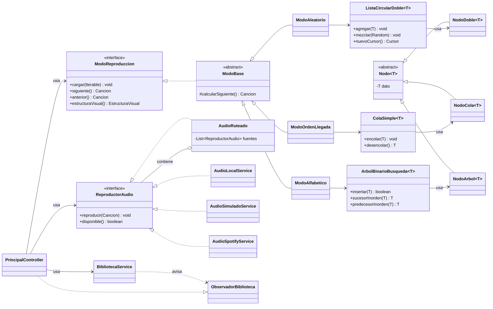

# Reproductor Camellos vs Enanos

Reproductor de música de escritorio en Java 21 + JavaFX 21.
Trabajo 1 de *Lenguajes y Compiladores* — Universidad EIA.

Cada modo de reproducción usa una **estructura de datos distinta, implementada desde cero**. No se
usa `LinkedList`, `Queue`, `Deque`, `TreeMap`, `TreeSet` ni `Collections.sort`.

| Modo | Estructura | Archivo |
|---|---|---|
| Aleatorio | Lista circular doblemente enlazada | `estructuras/ListaCircularDoble.java` |
| Orden de llegada | Cola FIFO | `estructuras/ColaSimple.java` |
| Alfabético | Árbol binario de búsqueda con punteros al padre | `estructuras/ArbolBinarioBusqueda.java` |

Para la sustentación: [Cómo funciona por dentro](#cómo-funciona-por-dentro) ·
[Complejidades](#complejidades-temporales) · [Guion](#guion-de-sustentación)

---

## Cómo ejecutarlo

**Requisitos: solo JDK 21.** No hace falta instalar Maven — se usa el que trae IntelliJ.

1. Abrir `pom.xml` en IntelliJ (*File → Open*).
2. Fijar el SDK del proyecto a **JDK 21** en *File → Project Structure*.
3. Panel de Maven → `Plugins` → `javafx` → `javafx:run`.

La aplicación arranca **sin internet y sin configuración**. Las carátulas, la búsqueda de metadatos
y Spotify son opcionales.

```
mvn test     # 480 pruebas
```

Al abrirla suena una presentación con el tema en 8 bits: la mascota baja colgada de su telaraña,
la señal se desgarra en dos chispazos, el logo entra de golpe y se llena la barra de carga.
**Un clic o cualquier tecla la salta** y entra directo.

Dura lo que dure la pista, entre 4 y 10 segundos, y los actos se reparten ese total en proporción.
La ventana se ajusta a la pantalla: si no cabe, se recorta el área de animación, nunca el marco.

> Música: *Spider-Man Theme (8 Bit Tribute to Spider-Man)*, de 8 Bit Universe. Se usa solo con
> fines académicos dentro de este trabajo de clase.

---

## Cómo funciona por dentro

### El recorrido de una canción, de la interfaz al altavoz

```
PrincipalController          ← solo conoce interfaces
    ├── BibliotecaService    ← dueña de las canciones, avisa por Observer
    ├── ModoReproduccion     ← una interfaz, tres implementaciones
    │     └── la estructura de datos que le toque
    └── ReproductorAudio     ← una interfaz, cuatro implementaciones
          └── AudioRuteado   ← encadena las fuentes y baja a la siguiente si una falla
```

**El controlador nunca pregunta de qué clase es nada.** Cambiar de modo es reasignar una
referencia; no hay un solo `switch` sobre tipos concretos. Lo mismo con el audio: el controlador no
sabe si suena un MP3, Spotify o un reloj simulado.

La comunicación de vuelta no son llamadas: `PrincipalController` implementa `ObservadorBiblioteca`
y se suscribe, y se ata a las `Property` observables del audio. Los servicios avisan sin conocer la
interfaz gráfica.

### Las tres estructuras

**Lista circular doble.** Un único campo, `primero`. **No hay `null` en los enlaces**: el último
apunta al primero. Con un solo elemento, el nodo se apunta a sí mismo por ambos lados — eso elimina
todos los casos especiales. Se navega con un `Cursor` que no puede pasarse del final porque no hay
final.

**Cola FIFO.** Punteros a `frente` y `fin`. Tener el puntero al `fin` es lo que hace que encolar sea
O(1) en vez de recorrer toda la cola. Al reproducir, la canción **sale de verdad** con
`desencolar()`: no se avanza un índice sobre una lista.

**Árbol binario de búsqueda.** Genérico, con el `Comparator` inyectado por constructor. Cada
`NodoArbol` guarda **puntero al padre**, y esa decisión es la clave del modo alfabético: permite
`sucesorInorden` y `predecesorInorden` caminando por el árbol vivo. Sin el padre, el sucesor de un
nodo sin subárbol derecho exigiría una pila auxiliar o aplanar el árbol a una lista. El borrado usa
transplante estilo CLRS con sus tres casos.

### Diagrama de clases



**La herencia, por si la preguntan:**

```
Nodo<T> (abstracta)  →  NodoDoble · NodoCola · NodoArbol
ModoBase (abstracta) →  ModoAleatorio · ModoOrdenLlegada · ModoAlfabetico
```

`ModoBase` aplica **Template Method**: `siguiente()` y `anterior()` son `final` y hacen siempre lo
mismo —validar, delegar, registrar en el historial—. Solo el paso variable se delega a
`calcularSiguiente()`, que es abstracto.

### Qué hace cada modo al avanzar

| | Aleatorio | Orden de llegada | Alfabético |
|---|---|---|---|
| `siguiente()` | `cursor.siguiente()` | `cola.desencolar()` | `arbol.sucesorInorden(actual)` |
| Al llegar al final | No hay final: da la vuelta | La cola queda vacía | Vuelve al mínimo |
| `anterior()` | `cursor.anterior()` | **No existe** | `arbol.predecesorInorden(actual)` |

El modo de orden de llegada devuelve `false` en `permiteAnterior()` y la interfaz deshabilita el
botón. No es una limitación de la interfaz: como la canción salió de la cola, **físicamente no hay
por dónde volver**. La estructura impone el comportamiento.

### La clase `Cancion`

14 atributos, frente a los 7 que pide el enunciado. El único obligatorio es el título. El `id` es un
UUID inmutable, y es el que manda:
`equals` compara por id y no por título, para admitir covers y versiones en vivo.

Se ordena con un `Collator` español en fuerza `PRIMARY`, que ignora tildes y mayúsculas ("Angel" y
"Ángel" comparan igual). **Desempata por artista y después por id**, y eso no es cosmético: el ABB
descarta lo que compare igual a un elemento ya insertado, así que sin desempate dos canciones
homónimas harían que el árbol perdiera una.

Los setters de artista, álbum y género nunca dejan el campo en blanco: lo sustituyen por
`"Desconocido"`.

### Editar una canción dispara dos eventos

`BibliotecaService.editar()` avisa `antesDeEditar` y `despuesDeEditar`. El árbol saca la canción
**antes** de que cambie el título y la reinserta después. Sin eso, renombrar "Creep" a "Bailando"
dejaría el nodo colgado bajo la letra C mientras el árbol lo busca bajo la B: la canción seguiría
en memoria pero sería inalcanzable.

---

## Audio

`ReproductorAudio` es la interfaz. Cuatro implementaciones:

| Fuente | Cuándo suena |
|---|---|
| `AudioSpotifyService` | Si Spotify está configurado y la canción tiene `uriSpotify` |
| `AudioLocalService` | Si hay un MP3 o WAV en `data/musica/` |
| `AudioSimuladoService` | Red de seguridad: un reloj que avanza sin sonido |
| `AudioRuteado` | No es una fuente: **encadena** las anteriores |

`AudioRuteado` es un **Composite** — implementa la misma interfaz que contiene. Si la fuente activa
falla, baja a la siguiente **recordando la posición** para retomar donde iba. La búsqueda arranca
después del índice que falló, así que cada fuente se prueba como mucho una vez por canción: no hace
falta un contador de intentos para evitar el bucle infinito.

`FabricaAudio.crear()` es el único sitio del proyecto que sabe qué fuentes existen:

```java
AudioRuteado enrutador = new AudioRuteado(new AudioLocalService(), new AudioSimuladoService());
AudioSpotifyService.crearSiEstaConfigurado().ifPresent(enrutador::agregarFuentePrioritaria);
```

Esa línea de Spotify fue **lo único** que hubo que escribir para sumar la fuente. El controlador,
la interfaz gráfica y las estructuras de datos quedaron sin tocar.

**Botón `FUENTE: AUTO / SOLO LOCAL`** — el controlador dice `audio.setEvitarRed(true)` y no nombra
ninguna fuente; el enrutador descarta las que declaren `requiereRed()`. Existe por si falla la red
del salón durante la sustentación.

**Barra de progreso arrastrable** — se puede arrastrar para buscar dentro de la canción. Solo al
soltar se llama a `buscarPosicion`: hacerlo en cada píxel del arrastre saturaría al reproductor.

---

## Qué se puede hacer

**Biblioteca.** Agregar, editar, eliminar, calificar y marcar favoritas. Se guarda en
`data/biblioteca.json` con escritura atómica. Al agregar una canción se leen sus etiquetas ID3 y se
busca la carátula en iTunes.

**Listas.** El selector **LISTA** elige qué se ve y qué suena:

| Entrada | Contenido |
|---|---|
| `TODA LA BIBLIOTECA` | Todas |
| `★ FAVORITAS` | Las de la estrella; se actualiza sola |
| `↺ HISTORIAL` | Lo último reproducido, de lo más reciente a lo más antiguo |
| Las tuyas | Las que crees con **+ NUEVA** |

Cualquier lista suena con cualquiera de los tres modos: los modos reciben `Iterable<Cancion>` y no
les importa de dónde salga. Agregar o quitar de una lista es clic derecho sobre la tabla.

> El historial no es una lista aparte: **es la `ColaSimple` que cada modo lleva dentro**, acotada a
> 100 y sacada a la interfaz. Encolar y descartar la más antigua cuesta O(1).

**Buscar y filtrar.** El selector de campo (`TODO`, `TÍTULO`, `ARTISTA`, `ÁLBUM`, `GÉNERO`) decide
dónde se busca. El buscador es un desplegable editable: se puede escribir, o abrirlo y elegir uno de
los valores que **de verdad hay** en la biblioteca — no hay ninguna lista fija de géneros en el
código. Las tildes y las mayúsculas dan igual.

**Estadísticas.** Total de reproducciones, minutos, artista y género más escuchados y el podio de
cinco. El contador sube al empezar cada reproducción y se persiste. La columna **REPR.** de la tabla
muestra lo mismo canción por canción.

**Ver la estructura por dentro.** El botón **VER ESTRUCTURA** abre una ventana que dibuja la
estructura que el modo activo tiene cargada **en ese momento**: el anillo con su cursor, la cola
vaciándose, el árbol con su forma real. Si las canciones entraron ya ordenadas, se ve degenerar en
una sola rama.

**Atajos de teclado.** No funcionan mientras se escribe en un campo o está abierto un desplegable.

| Tecla | Acción |
|---|---|
| `Espacio` | Reproducir / pausar |
| `←` `→` | ∓5 segundos |
| `Ctrl` + `←` `→` | Canción anterior / siguiente |
| `Ctrl` + `N` | Agregar canción |
| `Ctrl` + `F` | Ir al buscador |
| `Ctrl` + `D` | Cambiar entre modo claro y oscuro |

---

## Complejidades temporales

`n` = número de canciones · `h` = altura del árbol.

### Lista Ligada Circular Doble — modo Aleatorio

| Operación | Costo | Por qué |
|---|---|---|
| `agregar` | **O(1)** | Se inserta antes del primero, que es el último |
| `agregarEnPosicion` | O(n) | Hay que recorrer hasta la posición |
| `eliminar` | O(n) | Buscar es lineal; desenlazar es O(1) |
| `buscar` | O(n) | Sin índice, no hay atajo |
| `obtener(i)` | O(n) | Recorre **media** lista: elige el sentido más corto |
| `primero` / `ultimo` | **O(1)** | El último es `primero.getAnterior()` |
| `tamanio` / `estaVacia` | **O(1)** | Contador mantenido en cada alta y baja |
| `limpiar` | **O(1)** | Se suelta `primero`; el ciclo queda inalcanzable |
| `mezclar` | O(n) | Fisher–Yates, con O(n) de memoria auxiliar |
| `Cursor.siguiente` / `anterior` | **O(1)** | Un salto de puntero |

### Cola Simple FIFO — modo Orden de llegada

| Operación | Costo | Por qué |
|---|---|---|
| `encolar` | **O(1)** | Gracias al puntero al `fin` |
| `desencolar` | **O(1)** | Se avanza `frente` |
| `verFrente` / `verFin` | **O(1)** | Punteros directos |
| `tamanio` / `estaVacia` | **O(1)** | Contador mantenido |
| `buscar` | O(n) | No es una operación natural de una cola |
| `limpiar` | **O(1)** | Se sueltan las dos referencias |

### Árbol Binario de Búsqueda — modo Alfabético

| Operación | Costo | Por qué |
|---|---|---|
| `insertar` | O(h) | En cada nivel se descarta medio árbol |
| `eliminar` | O(h) | Buscar + transplantar |
| `buscar` | O(h) | — |
| `minimo` / `maximo` | O(h) | Bajar siempre hacia un lado |
| `sucesorInorden` / `predecesorInorden` | O(h) | Usa el puntero al padre |
| `altura` | O(n) | No hay forma de saber la rama más larga sin mirarlas todas |
| `recorridoInorden` | O(n) | Iterativo, memoria auxiliar O(1) |
| `tamanio` / `estaVacio` / `limpiar` | **O(1)** | — |

> **Ojo con `h`.** No es `log n`. Con el árbol equilibrado, `h ≈ log n`; con las canciones
> insertadas ya ordenadas alfabéticamente, el árbol degenera en una lista y **todo pasa a O(n)**.
> La solución sería un árbol autobalanceado (AVL o rojo-negro).

---

## Estructura del proyecto

```
src/main/java/com/eia/reproductor/
├── Lanzador.java        # main(); no extiende Application (ver nota abajo)
├── App.java             # arranque de JavaFX
├── modelo/              # Cancion, Playlist, EstructuraVisual (sealed)
├── estructuras/         # las tres estructuras, genéricas <T>
├── modos/               # un modo por estructura, tras una interfaz común
├── servicios/           # biblioteca, persistencia, metadatos, audio, filtros, estadísticas
├── animacion/           # sprites, animaciones y visualizador
└── controlador/         # controladores de FXML y ventanas
```

**Regla de capas:** ningún archivo de `estructuras/`, `modos/`, `servicios/` o `modelo/` importa
`javafx.scene.*`. La única excepción es `AudioLocalService`, porque `MediaPlayer` vive en
`javafx.scene.media` y no hay alternativa en el JDK; está documentada en la propia clase.

**Por qué existe `Lanzador`:** una clase `main` que extiende `Application` obliga a ejecutar con
*module path*. Con una clase lanzadora aparte, `java -cp` funciona sin `module-info.java`.

---

## Spotify con librespot (opcional)

> Sin esto la aplicación funciona completa con audio local. Si no querés instalar nada, saltate esta
> sección: si falta `config/spotify.properties`, la fuente de Spotify simplemente no se registra.

`librespot` es una implementación libre del cliente de Spotify. **No publica binarios para
Windows**, así que hay que compilarlo con Rust. Requiere cuenta **Premium**.

**1. Rust** — instalar [rustup](https://rustup.rs), opción `1) Proceed with standard installation`.
Comprobar en una terminal **nueva**: `cargo --version`.

**2. Build Tools de MSVC** — Rust en Windows compila con el enlazador de Microsoft. Sin esto
`cargo install` falla con `linker 'link.exe' not found`. Si ya tenés Visual Studio, **no bajes nada
nuevo**: abrí el Visual Studio Installer → *Modificar* → marcá **"Desarrollo de escritorio con
C++"**. Para ver si te falta:

```powershell
& "C:\Program Files (x86)\Microsoft Visual Studio\Installer\vswhere.exe" `
    -all -products * -requires Microsoft.VisualStudio.Component.VC.Tools.x86.x64 -property displayName
```

**3. Compilar** — `cargo install librespot --locked`, **sin flags de features**. Los valores por
defecto ya son los correctos para Windows (`native-tls` + `rodio-backend`). Pasarle
`--no-default-features` para "aligerar" rompe la compilación con
`Either feature "native-tls" must be enabled`. Tarda entre 5 y 15 minutos.

**4. Credenciales** — `copy config\spotify.properties.example config\spotify.properties` y rellenar
el `client.id` de una app registrada en el [dashboard de Spotify](https://developer.spotify.com/dashboard),
con Redirect URI `http://127.0.0.1:8888/callback`.

> librespot (el de Rust) **no tiene archivo de configuración**: se configura por flags de línea de
> comandos desde `ProcesoLibrespot`. `spotify.properties` es el único archivo, y está en `.gitignore`
> junto con el token. **No hay ningún secreto en el código fuente.**

**5. Autorizar** — al arrancar la aplicación se abre el navegador una sola vez. La autenticación es
**OAuth 2.0 con PKCE**: la aplicación nunca ve tu contraseña, solo recibe un código de un solo uso.
El token queda en `config/token-spotify.json` y se refresca automáticamente antes de vencer.

`AudioSpotifyService.disponible()` exige las tres cosas a la vez: proceso de librespot arriba,
sesión válida y dispositivo transferido. Si falla cualquiera, el enrutador baja a audio local sin
avisos ni ventanas emergentes.

---

## Guion de sustentación

La rúbrica pide que **cada integrante** explique una estructura: por qué se eligió, cómo funciona
por dentro y su complejidad.

###Lista Circular Doble (modo Aleatorio)

- **Por qué esta:** el modo pide navegar en las dos direcciones sin final. *Circular* resuelve el
  "sin final"; *doble* resuelve las "dos direcciones".
- **Por dentro:** nunca hay `null`. Con un solo elemento, el nodo se apunta a sí mismo por ambos
  lados, y eso elimina los casos especiales.
- **Mostrar:** el anillo en el visualizador, y cómo al pasar del último se vuelve al primero sin
  ningún `if`.
- **Preguntas probables:**
  - *¿Por qué insertar al final es O(1) si no guardás un puntero al último?* Porque en una lista
    circular el último **es** `primero.getAnterior()`.
  - *¿Qué mezclás, los datos o los nodos?* Los nodos. Si se movieran los datos, un cursor que apunta
    a un nodo se encontraría de pronto con otra canción.

###Cola Simple (modo Orden de llegada)

- **Por qué esta:** el modo es FIFO puro. La cola *es* FIFO; usar otra cosa sería fingirlo.
- **Por dentro:** punteros a `frente` y `fin`, las dos operaciones en O(1). El puntero al `fin` es
  lo que evita recorrer la cola en cada encolado.
- **Mostrar:** que al reproducir la canción **sale de verdad**. En el visualizador se ve la cola
  vaciarse y el contador de las que ya salieron.
- **Preguntas probables:**
  - *¿Por qué no un `ArrayList` con un índice?* Porque entonces no sería una cola: los elementos
    seguirían ahí.
  - *¿Y si quiero volver atrás?* No se puede, a propósito. `permiteAnterior()` devuelve `false`
    porque la canción ya salió de la estructura.

###Árbol Binario de Búsqueda (modo Alfabético)

- **Por qué esta:** el orden alfabético sale **gratis** del recorrido inorden; no hay que ordenar
  nada.
- **Por dentro:** cada nodo guarda **puntero al padre**. Esa es la decisión clave: permite
  `sucesorInorden` caminando por el árbol vivo, en vez de aplanarlo a una lista y moverse por
  índices, que sería hacer trampa.
- **Mostrar:** el árbol dibujado con la canción en curso resaltada.
- **Preguntas probables:**
  - *¿Cuál es el peor caso?* Insertar ya ordenado: degenera en lista y todo cae a O(n). Se
    arreglaría con un AVL.
  - *¿Cómo se elimina un nodo con dos hijos?* Se reemplaza por su **sucesor inorden** —el mínimo del
    subárbol derecho— y se transplanta, como en CLRS.
  - *¿Y dos canciones con el mismo título?* `Cancion.compareTo` desempata por artista y después por
    `id`. Sin ese desempate el árbol descartaría una como duplicada y **se perdería**.
  - *En el dibujo, ¿por qué un nieto queda a veces más a la izquierda que su abuelo?* Porque el
    dibujo es compacto. La garantía del ABB es **local**: respecto de cada nodo, a su izquierda van
    las anteriores y a su derecha las posteriores. El orden alfabético sale de **recorrer** el
    árbol, no de barrer la imagen con la vista.

### Cierre — decisiones transversales

- **Polimorfismo:** el controlador solo conoce interfaces. Cambiar de modo es reasignar una
  referencia; no hay un solo `switch` sobre tipos concretos.
- **Genéricos:** las tres estructuras son `<T>` y se prueban con `Integer` y `String` además de con
  `Cancion`, lo que demuestra que no dependen del dominio.
- **Separación lógica/presentación:** con una única excepción documentada.
- **Patrones:** Template Method (`ModoBase`), Observer (`ObservadorBiblioteca`), Composite
  (`AudioRuteado`), Factory (`FabricaAudio`).
- **Java 21:** interfaz `sealed` + `record`s + `switch` con patrones en `EstructuraVisual`, con el
  `switch` exhaustivo sin `default` — si se agregara un cuarto modo, el proyecto no compilaría hasta
  decidir cómo se dibuja.
